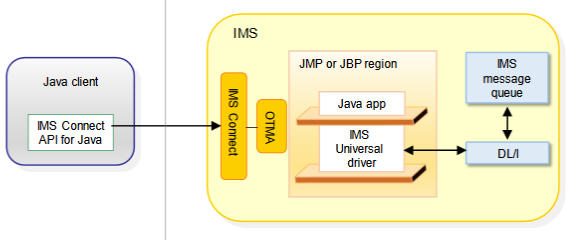
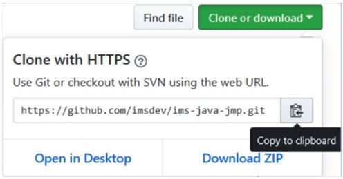
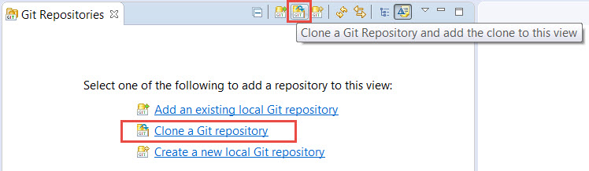

# Sample IMS Java message processing (JMP) application

The sample Java™ applications run in the IMS™ Java Message Processing (JMP) region and demonstrates how to write a Java application that runs as an IMS transaction. 

After the application is deployed to the IMS environment, a sample client application is provided that sends the input message to the transaction and displays the output message.

Two copies of the sample are provided. The version in the `insurance/` directory also demonstrates how to issue SQL queries to an IMS database. The version in the `insurancenodb/` directory does not require a database, and has customer data hard-coded in the sample.

## Scenario
A user wants to retrieve the insurance policies information for a specified customer number. The JMP application will retrieve insurance policies information based on the customer number that is specified by the client application. 

## Prerequisites
* IMS Universal JDBC driver
  * Download from [Universal JDBC driver](https://www-01.ibm.com/marketing/iwm/iwm/web/download.do?source=swg-imsUD&pageType=urx&S_PKG=dlUD) or obtain via the IMS JAVA ON DEMAND FEATURES FMID JMK1406
* IMS Enterprise Suite Connect API version 3.2
  * Download from [IMS Connect API for Java](https://www-01.ibm.com/marketing/iwm/iwm/web/pickUrxNew.do?source=swg-imsentersuite32) or obtain via Connect API for Java FMID JAHF323
 
## Repository structure
For both versions of the sample, the files in the `src/` directory has the following structure:

* `main/`
  * `java/`: The sample Java application. See the Sample overview section for more information.
  * `resources/`: Add the Universal Drivers JDBC driver to the `main/resources` folder.
* `test/`
  * `java/client/`: The client application that specifies the customer number for whom to retrieve insurance policies information. The client application uses the IMS Connect API to connect to IMS. 
  * `resources/`: Add IMS Connect API for Java JAR to the resources folder. The JAR is used by the client application to access IMS Connect.  Place the JAR in the `test/resources` folder.
 
## Program flow / Architecture

## Samples overview
Sample application code is available in the `src/main/java` directory.

* `controller/`: The main Java application
* `customer/info`: 
  * `Customer.java`: Provides methods for retrieving customer information 
  * `CustomerService.java`: 
     * For the database-version of the sample (`insurance/`): Contains SQL queries to retrieve customer info from the database.
	 * For the no-database-version of the sample (`insurancenodb/`): Contains hard-coded customer data so a database is not required for this sample.

* `message/`:  
  * `InputMessage.java`: Defines the structure of the input message that the Insurance application receives. It  defines the field name, field type, the start position, and the length of each field. It also specifies the length of the entire message in the call to the super constructor.
  * `CustomerOutputMessage.java`:  Defines the customer output message. This code represents the output message structure for the customer segment. It defines the field name, field type, the start position, and the length of each field. It also specifies the length of the entire message in the call to the super constructor.

* `policy/info`
  * `AutoPolicy.java`: Provides methods for retrieving auto insurance policy information
  * `HousePolicy.java`: Provides methods for retrieving house insurance policy information

## Steps to using the samples

### Downloading the samples from this GitHub repository
On this GitHub repository page, click the **Clone or download** button and click **Download ZIP** to download the entire project. 

You can also copy the URL of this repository, then in your Eclipse integrated development environment (IDE), go to the **Git Repositories** view, click the **Clone a Git repository** hyperlink.

The Git repository URL should be automatically filled in with the URL that you copied earlier.
   

### Compiling, uploading, and deploying the Java application on IMS

1. Compile the sample Java application. Start with the version in the `insurancenodb/` directory as it does not require additional database infrastructure setup.
    * Right-click the `pom.xml` file in the project and select **Run As** -> **Maven install**.
    * The application jar file will be compiled to the "target" folder of the project. 
2. Export the application .jar file and upload it to the USS file system in binary mode.
3. Work with your system programmer to ensure that IMS is set up to run Java applications in the JMP region.  The transaction and the JMP region must be started.  
   See the [IMS DevOps samples for Java applications](https://github.com/imsdev/ims-devops-java) repository for samples that demonstrate and assist your environment configuration and application deployment tasks.

**Note**: To use the database version of the sample in the `insurance/` directory, there are additional requirements to set up the infrastructure needed for open access to IMS database and to set up the sample IMS insurance database. 
The details will be provided in the <i>Open access to IMS data repository (coming soon)</i>. You can also check out the [Implementing open access for Java applications](https://www.ibm.com/support/knowledgecenter/SSEPH2_14.1.0/com.ibm.ims14.doc.sk/ims_openacc_getstart.htm) topic in the **Open access solution adoption kit** in IBM Knowledge Center. 
The solution adoption kit is a set of learning resources such as articles, videos, blog posts, and sample code that helps you and your team through your application modernization journey.

### Testing the Java application
Modify the client application in `test/java/client/` to call the Java application on IMS.

1. Obtain from your system programmer or system administrator the following information that is required to access IMS for testing:
   * IP address or host name
   * Data store name
   * Port number
   * IMS Connect port number
   * RACF ID
   * RACF group name
5. Modify the client application in with the correct connection info to access IMS.
6. Compile the client application.
7. Run the client application.

## More information
A Java sample based on the database version that queries an IMS database is available in the [Java in IMS solution adoption kit](https://www.ibm.com/support/knowledgecenter/en/SSEPH2_14.1.0/com.ibm.ims14.doc.sk/ims_apmdovr.htm) in IBM Knowledge Center. 

The solution adoption kit is a set of learning resources such as articles, videos, blog posts, and sample code that helps you and your team through your application modernization journey. 
